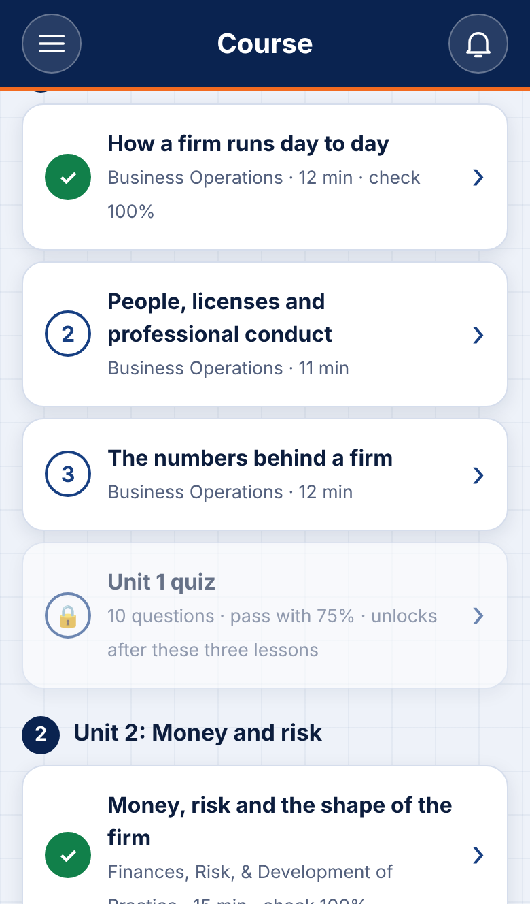
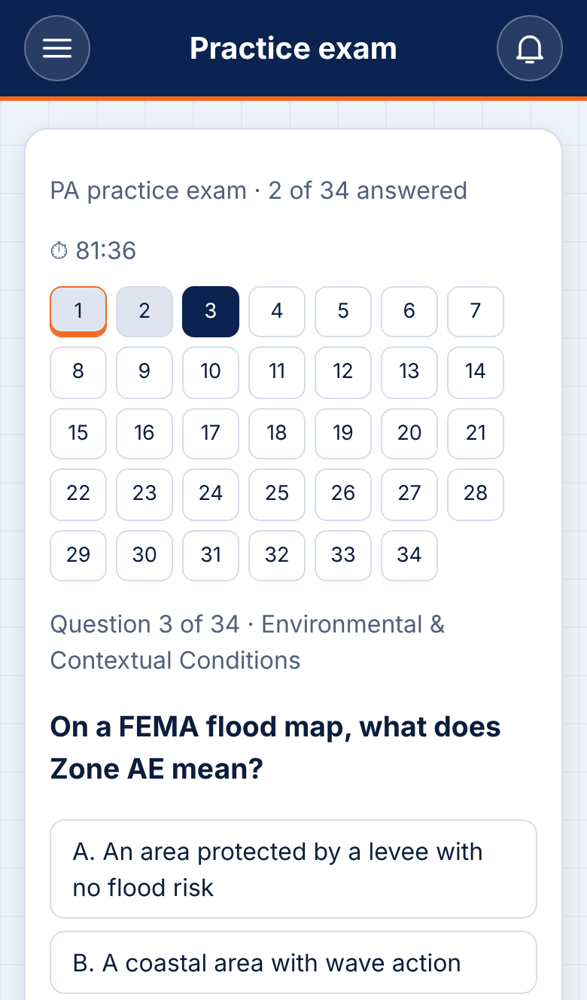
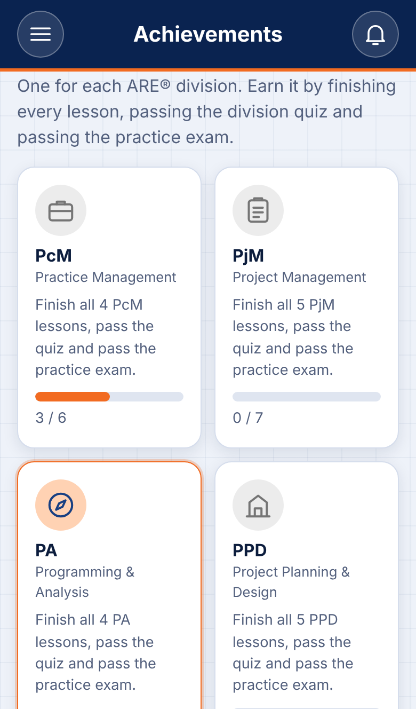
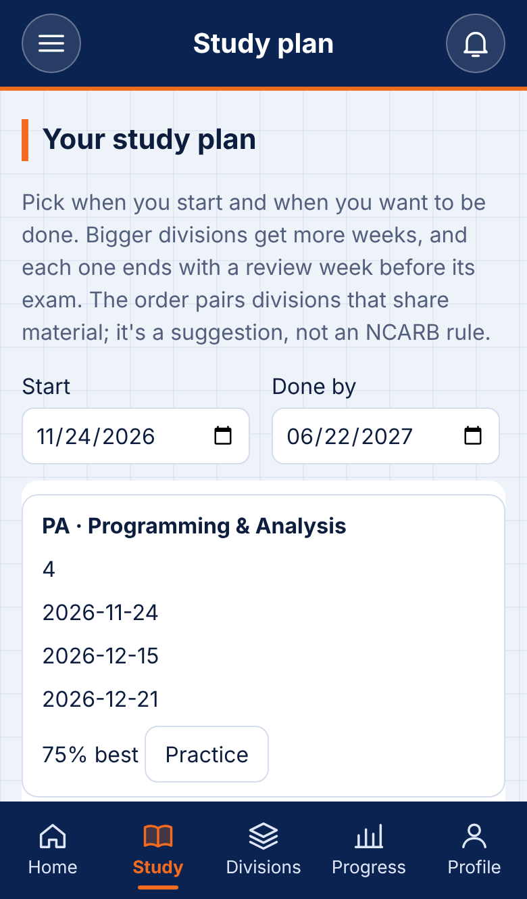
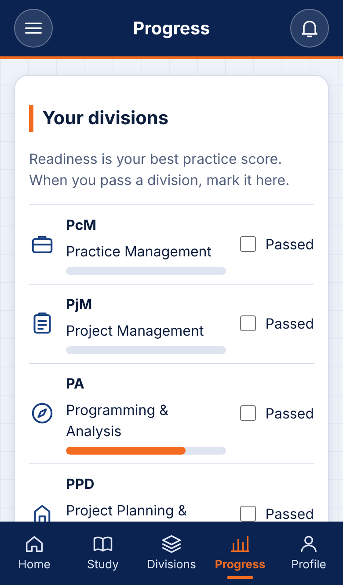

# 📐 Florida Architect Exam Prep (Architecture License Study)

A study app for the architect registration exam (ARE® 5.0) and the path to an architect license in Florida, written for architecture students and recent graduates in Gainesville who want to pass every division on the first try. It installs on an iPhone like an app and works offline.

**Live app:** [theoyanvno.github.io/florida-architect-exam-prep](https://theoyanvno.github.io/florida-architect-exam-prep/)

**Status:** finished. Each of the six divisions is a full path of lessons, a quiz and a practice exam, with 216 questions, 300 flashcards and 23 achievement badges, and it installs on iPhone and Android.

## Screenshots

| Home | Course | Lesson |
|---|---|---|
|  |  |  |
| **Practice exam** | **Achievements** | **Study plan** |
|  |  |  |
| **Practice** | | |
|  | | |
| **Flashcards** | **Progress** | **Campus & career** |
|  |  |  |

## Put it on your iPhone

1. Open the live app in **Safari**.
2. Tap **Share** (the square with an arrow pointing up).
3. Tap **Add to Home Screen**, then **Add**.

It opens full screen from its own icon, keeps your progress on the phone, and works without a connection after the first visit. On Android, use Chrome's menu and **Install app**.

## How the course works

Like CodeForge, each division is a path in three steps:

1. **Lessons.** One lesson for each NCARB content section. Each one teaches the material, works the numbers, sums up what to remember and ends with a four-question check (75% finishes it).
2. **Division quiz.** Unlocks when every lesson is finished: 10 questions on what the lessons taught, with the answer and explanation after each one. Pass with 75%.
3. **Practice exam.** Unlocks when the quiz is passed: every question for the division, including 10 you won't have seen in a lesson or quiz. As on the real exam, you don't see answers until you submit, and you can flag questions and jump between them. The timer keeps the real division's pace. Pass with 70%; results are broken down by NCARB section.

Pass all three to earn the division's badge. **Achievements** award points (20 per lesson, 50 per quiz, 100 per exam, 2 per flashcard). There are three levels (Candidate, Course graduate, Exam ready), a badge for each division and 14 milestones such as Perfect quiz, Beat the clock and a 7-day streak. Free practice and flashcards stay open at any time.

## What it covers

- **A full course:** 27 lessons, one for each NCARB content section of the six divisions (about 5½ hours of reading). Each lesson teaches the material in plain words, works examples where numbers matter (fees, earned value, FAR, exit separation, stairs, payment applications), sums up what to remember, and ends with a four-question check; 75% finishes the lesson
- Readiness for each division counts lessons finished (40%) and your best practice or exam score (60%)
- A home screen with your overall progress, days to your goal date, divisions left and your practice average, a card for each division with your readiness, and the study tools
- A Progress page to mark divisions passed, and a Profile page for your name, your dates and installing on iPhone
- The six ARE 5.0 divisions with NCARB's item counts, test times and section weights
- The AXP experience hours by area
- A Florida licensing checklist from the Florida Board of Architecture and Interior Design
- A study plan that spreads the six divisions between your start and goal dates, saved in the browser
- 216 original questions (the lesson checks, 48 practice questions and 60 exam questions), one division at a time or a 20-question mixed test, with an optional timer at the exam's pace, explanations, a score by NCARB section and your best score saved
- Answer choices shuffled every session, a review of every question you missed, and a Missed list to practice until you get them right
- A Campus & career page of help around the University of Florida campus: the School of Architecture, IPAL at the UF CityLabs, the Architecture & Fine Arts Library and its databases, UF AIAS, NOMAS and Alpha Rho Chi, the Career Connections Center for AXP jobs, and AIA Florida's ARE Scholarship (up to two ARE seat credits) and the free AIA PrepARE Exam Readiness Pack for eligible Associate AIA members
- 300 flashcards of key terms (50 per division) with Got it and Again, saved in the browser

Every fact links to its source (NCARB, the Florida DBPR board pages and the University of Florida School of Architecture). Practice questions are written for this app; nothing is copied from NCARB or prep companies.

## Run it

```
npm install
npm start      # http://localhost:8000
npm test       # the course, the quiz and exam path, achievements, questions, flashcards, study plan and progress
npm run build  # builds the site into docs/ for GitHub Pages
```

It works the same on Windows, macOS and Linux (in the VS Code terminal on Windows).

## Built with

React, JavaScript, esbuild, a web app manifest and service worker (installable, offline), Node's test runner

## Credits

Built with help from AI coding tools; every feature is reviewed and tested before it ships. Not affiliated with, sponsored or endorsed by NCARB, the University of Florida, the Florida DBPR or the AIA. No school logos, marks or landmark images are used, and the navy-and-orange palette is the app's own. ARE®, AXP® and NCARB® are registered trademarks of the National Council of Architectural Registration Boards; AIA® is a registered trademark of the American Institute of Architects; they are named only to describe what the app helps you study. The hero and icon art are original drawings.

## License

MIT. See [LICENSE](LICENSE).
